# HR Automation: Dataverse Data Model

This is the agreed table design for the `hrautomation` solution (publisher prefix `hra`, choice value prefix `81799`).
Claude Code builds these tables phase by phase, as described in `PROMPT.md`. Change this file first if the design changes.

**Conventions**
- Schema names are `hra_` + PascalCase singular, for example `hra_LeaveRequest`. Logical names are lowercase, for example `hra_leaverequest`.
- Choice values start at `817990000`.
- **Ownership:** "Org" means organization-owned reference data, which only HR Admin can edit. "User" means user- or team-owned records, which respect business unit, team and hierarchy security.
- **No hard deletes for people data.** Employees, candidates and requisitions are deactivated, not deleted. Relationships from the Employee table use **Restrict** delete.
- **Columns marked 🔒** are protected by a column security profile (see Security).
- **Dates** are date-only columns (user-local behaviour off) unless they're marked as date-time.

---

## 1. Global choices

| Choice | Values |
|---|---|
| `hra_employmenttype` | Permanent, Probation, Contract, Intern, Consultant |
| `hra_employmentstatus` | Active, On Notice, Separated, Absconding, Retired |
| `hra_gender` | Female, Male, Non-binary, Prefer not to say |
| `hra_indianstate` | 28 states + 8 union territories (Andhra Pradesh … West Bengal, Delhi, Jammu and Kashmir, Ladakh, Puducherry, Chandigarh, Lakshadweep, Andaman and Nicobar Islands, Dadra and Nagar Haveli and Daman and Diu) |
| `hra_approvalstatus` | Draft, Submitted, Approved, Rejected, Cancelled, Withdrawn |
| `hra_responsibleteam` | HR, IT, Admin/Facilities, Finance, Reporting Manager, Employee |
| `hra_documenttype` | PAN Card, Aadhaar (masked), Passport, Offer Letter, Appointment Letter, Relieving Letter, Education Certificate, Experience Letter, Medical Certificate, Other |
| `hra_rating` | 1 – Needs Improvement, 2 – Partially Meets, 3 – Meets, 4 – Exceeds, 5 – Outstanding |

---

## 2. Tables by module

### Core HR (Phase 1)

| Table | Own. | Purpose | Key columns |
|---|---|---|---|
| `hra_Department` | Org | Departments | Name, Code (alt key), Parent Department (self-lookup), Department Head → Employee, Cost Centre |
| `hra_Designation` | Org | Job titles and grades | Name, Grade/Band (choice: L1–L8), Department |
| `hra_Location` | Org | Office locations | Name, City, State (`hra_indianstate`), Address, Holiday Calendar → `hra_HolidayCalendar` (lookup added in Phase 2) |
| `hra_Employee` | User | The employee master record | **Employee Number** (autonumber `EMP-{SEQNUM:4}`, alt key), First/Middle/Last Name, Full Name, Work Email (alt key), Personal Email, Mobile, Date of Birth, Gender, Date of Joining, Probation End Date, Confirmation Date, Employment Type, Employment Status, Department, Designation, Location, **Reporting Manager** (self-lookup), HR Business Partner → Employee, **System User** → `systemuser` (for self-service and security), Leave Policy → `hra_LeavePolicy` (lookup added in Phase 2), Notice Period (days), Last Working Day, Years of Service (formula), Gratuity Eligible (formula: ≥ 5 years). 🔒 PAN, 🔒 Aadhaar Last 4, 🔒 UAN, 🔒 ESIC Number, 🔒 Bank Account Number, 🔒 IFSC, 🔒 Bank Name, 🔒 Annual CTC (currency, INR) |
| `hra_EmergencyContact` | User | Emergency contacts | Employee, Name, Relationship, Phone, Is Primary |
| `hra_EmployeeDocument` | User | Employee documents | Employee, Document Type (`hra_documenttype`), File (file column), Issue Date, Expiry Date, Verified (yes/no), Verified By |
| `hra_EmploymentHistory` | User | Audit trail of job changes | Employee, Change Type (Joining, Confirmation, Promotion, Transfer, Manager Change, Salary Revision, Separation), Effective Date, From/To Department, From/To Designation, From/To Location, From/To Manager, 🔒 From/To CTC, Remarks |
| `hra_HRCase` | User | HR helpdesk tickets (also used by the Copilot agent) | Case Number (autonumber), Employee, Category (Payroll, Leave, Policy, Documents, IT Access, Other), Subject, Description, Priority, Status (New, In Progress, Waiting on Employee, Resolved, Closed), Assigned To |

### Leave & Attendance (Phase 2)

| Table | Own. | Purpose | Key columns |
|---|---|---|---|
| `hra_HolidayCalendar` | Org | One calendar per state per year | Name (for example "Karnataka 2026"), Year, State |
| `hra_Holiday` | Org | Holiday dates | Holiday Calendar, Date, Name, Type (National, State, Optional/Restricted) |
| `hra_LeaveType` | Org | Leave types | Name, Code (alt key: EL, CL, SL, ML, PTL, BL, CO, LOP), Is Paid, Allow Half Day, Applicable Gender, Max Consecutive Days, Document Required After (days), Is Encashable, Counts Sandwich Holidays (yes/no) |
| `hra_LeavePolicy` | Org | A named set of leave rules | Name, Applicable Employment Type, Leave Year Start Month (default April), Is Default |
| `hra_LeavePolicyLine` | Org | Entitlement per leave type in a policy | Leave Policy, Leave Type, Annual Entitlement (days), Accrual Frequency (Upfront, Monthly, Quarterly), Max Carry Forward, Max Encashment, Available During Probation |
| `hra_LeaveBalance` | User | Balance per employee, leave type and year | Employee, Leave Type, Leave Year (text, for example "2026-27"), Opening, Accrued, Taken, Adjusted, Carried Forward, Encashed, **Available** (formula). Alt key: Employee + Leave Type + Leave Year |
| `hra_LeaveRequest` | User | Leave applications | Request Number (autonumber), Employee, Leave Type, From Date, To Date, First Day Half / Last Day Half, **Number of Days** (set by plugin), Reason, Attachment (file), Status (`hra_approvalstatus`), Approver → Employee, Actioned On (date-time), Approver Comments, Leave Balance (lookup) |
| `hra_AttendanceRecord` | User | Daily attendance | Employee, Date, Check-in / Check-out (date-time), Hours Worked (formula), Status (Present, Work From Home, Half Day, Absent, On Leave, Holiday, Weekly Off), Source (Manual, Device, Teams/Shift). Alt key: Employee + Date |

### Recruitment & Onboarding (Phase 3)

| Table | Own. | Purpose | Key columns |
|---|---|---|---|
| `hra_JobRequisition` | User | Request to hire | Requisition Number (autonumber), Job Title, Department, Designation, Location, Number of Positions, Employment Type, Reason (New Position, Replacement), Replacing Employee, 🔒 Budget CTC Min/Max, Hiring Manager → Employee, Recruiter → `systemuser`, Job Description (rich text), Target Join Date, Approval Status, Status (Open, On Hold, Filled, Cancelled), Publish on Careers Site (yes/no) |
| `hra_Candidate` | User | Candidate profile | Full Name, Email (alt key), Phone, Current Company, Total Experience (years), 🔒 Current CTC, 🔒 Expected CTC, Notice Period (days), Source (Careers Site, Referral, LinkedIn, Job Portal, Agency, Walk-in), Referred By → Employee, Resume (file), **Consent Given** + Consent Date (DPDP), Retain Until (date) |
| `hra_JobApplication` | User | One candidate applying for one requisition | Candidate, Job Requisition, Applied On, Stage (business process flow: Screening → Interview → Offer → Hired), Status (Active, Rejected, Withdrawn, Hired), Rejection Reason |
| `hra_Interview` | User | An interview round | Job Application, Round (Screening, Technical 1, Technical 2, Managerial, HR), Start / End (date-time), Mode (In-person, Teams, Phone), Teams Link, Lead Interviewer → Employee, Panel (N:N with Employee), Result (Pending, Selected, Rejected, On Hold) |
| `hra_InterviewFeedback` | User | Feedback scorecard per interviewer | Interview, Interviewer → Employee, Technical / Communication / Culture Fit / Problem Solving scores (1–5), Overall Score (formula), Recommendation (Strong Hire, Hire, No Hire), Comments |
| `hra_Offer` | User | Job offer | Job Application, Designation, 🔒 Offered CTC, Proposed Join Date, Offer Letter (file), Approval Status, Status (Draft, Approved, Sent, Accepted, Declined, Revoked), Accepted On |
| `hra_ChecklistTemplate` | Org | Onboarding or offboarding template | Name, Type (Onboarding, Offboarding), Applies To Employment Type, Is Default |
| `hra_ChecklistTemplateItem` | Org | Template tasks | Checklist Template, Task Name, Responsible Team (`hra_responsibleteam`), Due Offset (days from joining date or last working day), Sequence, Is Mandatory |
| `hra_EmployeeChecklist` | User | Checklist created for one employee | Employee, Checklist Template, Type, Start Date, Status (Not Started, In Progress, Completed), Completion % (rollup) |
| `hra_ChecklistTask` | User/Team | A task assigned to a team or user | Employee Checklist, Task Name, Responsible Team, Owner (team or user), Due Date, Status (Open, Done, Not Applicable), Completed On, Remarks |
| `hra_Separation` | User | Resignation or exit | Employee, Type (Resignation, Termination, Retirement, Absconding, End of Contract), Resignation Date, Requested Last Working Day, Approved Last Working Day, Notice Shortfall (days, formula), Reason, Approval Status, Exit Interview Notes, Full and Final Status (Pending, In Progress, Settled) |

### Performance, Assets & Expenses (Phase 4)

| Table | Own. | Purpose | Key columns |
|---|---|---|---|
| `hra_AppraisalCycle` | Org | Review period | Name (for example "FY 2026-27"), Start / End Date, Goal Setting Due, Self Review Due, Manager Review Due, Status (Planned, Goal Setting, Review, Calibration, Closed) |
| `hra_PerformanceReview` | User | One employee in one cycle | Appraisal Cycle, Employee, Reviewer → Employee, Stage (business process flow: Self Review → Manager Review → Calibration → Closed), Self Rating, Manager Rating, Final Rating (`hra_rating`), Promotion Recommended, 🔒 Increment %, Comments. Alt key: Cycle + Employee |
| `hra_Goal` | User | Goals and KPIs | Performance Review, Employee, Title, Description, KPI / Measure, Weightage %, Target, Achievement, Self Rating, Manager Rating, Status (Not Started, On Track, At Risk, Achieved, Dropped) |
| `hra_Asset` | Org | Company assets | Asset Tag (alt key), Name, Category (Laptop, Desktop, Monitor, Mobile, SIM, Access Card, Peripheral, Other), Make/Model, Serial Number, Purchase Date, Cost, Warranty End, Status (Available, Assigned, In Repair, Retired, Lost) |
| `hra_AssetAssignment` | User | Asset given to an employee | Asset, Employee, Assigned On, Expected Return, Returned On, Condition on Return, Status (Assigned, Returned, Lost/Damaged) |
| `hra_ExpenseClaim` | User | Reimbursement claim | Claim Number (autonumber), Employee, Title, Claim Date, Total Amount (rollup, INR), Status (`hra_approvalstatus` + Paid), Approver → Employee, Approved On, Paid On, Payment Reference |
| `hra_ExpenseLine` | User | One expense item | Expense Claim, Expense Date, Category (Travel, Local Conveyance, Food, Lodging, Fuel, Internet/Phone, Client Entertainment, Other), Amount, GST Amount, Receipt (file), Description |

That's 34 tables in total. They fit within Dataverse capacity for about 100 employees.

---

## 3. Relationship diagram (main relationships)

```mermaid
erDiagram
    hra_Department ||--o{ hra_Employee : has
    hra_Designation ||--o{ hra_Employee : has
    hra_Location ||--o{ hra_Employee : works_at
    hra_Employee ||--o{ hra_Employee : manages
    hra_Employee ||--o{ hra_EmergencyContact : has
    hra_Employee ||--o{ hra_EmployeeDocument : has
    hra_Employee ||--o{ hra_EmploymentHistory : has
    hra_Employee ||--o{ hra_HRCase : raises

    hra_HolidayCalendar ||--o{ hra_Holiday : contains
    hra_HolidayCalendar ||--o{ hra_Location : used_by
    hra_LeavePolicy ||--o{ hra_LeavePolicyLine : defines
    hra_LeaveType ||--o{ hra_LeavePolicyLine : in
    hra_LeavePolicy ||--o{ hra_Employee : assigned_to
    hra_Employee ||--o{ hra_LeaveBalance : has
    hra_LeaveType ||--o{ hra_LeaveBalance : for
    hra_Employee ||--o{ hra_LeaveRequest : applies
    hra_LeaveType ||--o{ hra_LeaveRequest : of
    hra_Employee ||--o{ hra_AttendanceRecord : logs

    hra_JobRequisition ||--o{ hra_JobApplication : receives
    hra_Candidate ||--o{ hra_JobApplication : submits
    hra_JobApplication ||--o{ hra_Interview : has
    hra_Interview ||--o{ hra_InterviewFeedback : gets
    hra_JobApplication ||--o| hra_Offer : results_in
    hra_ChecklistTemplate ||--o{ hra_ChecklistTemplateItem : contains
    hra_Employee ||--o{ hra_EmployeeChecklist : has
    hra_EmployeeChecklist ||--o{ hra_ChecklistTask : contains
    hra_Employee ||--o{ hra_Separation : has

    hra_AppraisalCycle ||--o{ hra_PerformanceReview : includes
    hra_Employee ||--o{ hra_PerformanceReview : reviewed_in
    hra_PerformanceReview ||--o{ hra_Goal : has
    hra_Asset ||--o{ hra_AssetAssignment : assigned_via
    hra_Employee ||--o{ hra_AssetAssignment : holds
    hra_Employee ||--o{ hra_ExpenseClaim : submits
    hra_ExpenseClaim ||--o{ hra_ExpenseLine : contains
```

---

## 4. Security (summary)

Use one business unit, an owner team per department, and **manager hierarchy security** based on `hra_Employee.Reporting Manager` → System User. This lets each manager see only their own reports.

| Role | Access |
|---|---|
| **HR Admin** | Full access to every `hra_` table, including reference data and settings |
| **HR Manager** | Read and write at organization level on people, leave, recruitment, performance and separation records. Read-only on reference data |
| **Recruiter** | Requisitions, Candidates, Applications, Interviews, Offers. No access to Employee sensitive columns |
| **Line Manager** | Read and approve for their own team (through hierarchy): leave, attendance, expenses, reviews, goals, interviews they're on. Create Job Requisitions |
| **Employee (self-service)** | Their own Employee record (read, plus limited edits), their own leave, attendance, expenses, goals, documents and HR cases |
| **IT / Asset Admin** | Assets and Asset Assignments, plus checklist tasks for the IT team |
| **Finance** | Read and update Expense Claims (payment fields) and checklist tasks for the Finance team |

**Column security profiles**
- **HR Sensitive:** PAN, Aadhaar Last 4, UAN, ESIC, bank details and CTC on Employee and Employment History. Only HR Admin and HR Manager have access.
- **Compensation (Recruitment):** Candidate CTC, Offer CTC, Requisition budget and Increment %. Access goes to HR Admin, HR Manager and Recruiter (Recruiter can read).

**Auditing:** turn it on for Employee, Employment History, Leave Request, Leave Balance, Offer, Separation and Performance Review, and for every 🔒 column.
